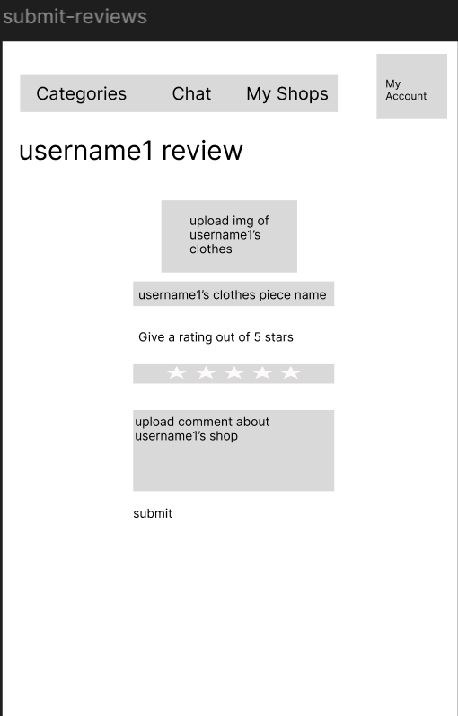

# ClozExchange 

## Overview

Clothes has become a staple. And some clothes will continue to be fashionable while others won't be. How can we create a sustainable way to dress well instead of promoting fast fashion. 

ClozExchange is a web app that allows users to trade clothes with other users. Users can register and login. Once they're logged in, they can promote which clothes they want to trade with others. Every user has a shop under a category of clothing where they showcase their clothes that they would like to trade with others, they can add and remove items from the shop. This promotes a more sustainable approach and also promotes good fashion (embodying the idea of thrifting and bartering but combined).

## Data Model

The application will store Users, 

* Users can have multiple shops (based on the category of clothing: shirts, shorts, pants etc.)
* Each shop can have multiple clothing items (by embedding) and is associated with a specific clothing category
* Users can have multiple chats
* Users can write reviews for other users' shops, and user shops can receive multiple reviews from different users

An Example User:

```javascript
{
  username: "bennytrader",
  hash: // a password hash,
  shops: // an array of references to Shop documents
  chats: // an array of references to Chat documents
  reviews: // an array of references to User's Reviews documents
  profession: 'Amateur'
}
```

An Example List with Embedded Items:

```javascript
{
  user: // a reference to a User object
  shops: [
    {
      name: "pants",
      items: [
        { name: "Jeans", quantity: 20, checked: false },
        { name: "Chinos", quantity: 10, checked: false }
      ]
    },
    {
      name: "shirts",
      items: [
        { name: "T-shirts", quantity: 15, checked: false },
        { name: "Dress shirts", quantity: 5, checked: false }
      ]
    }
  ],
  chats: [
    { withUser: "username1", category: "pants", lastMessageChecked: false },
    { withUser: "username2", category: "shirts", lastMessageChecked: false }
  ],
  reviews: [ 
    { reviewer: "username1", category: "pants", comment: "Great quality!", checked: false },
    { reviewer: "username2", category: "shirts", comment: "Satisfied", checked: false }
  ],
  createdAt:
}
``` 

## [Link to Commented First Draft Schema](src/db.mjs) 

## [Wireframes](https://www.figma.com/design/99dIYCjyoACnFUPb4f8RNp/Untitled?node-id=37-2&t=l5TFQG02U1OAv6QA-1)

<div align="center">

### /shop/create - **Page for creating a new shop**
  


</div>

<div align="center">

### /shops - **Page for showing all the shops**
  


</div>

<div align="center">

### /shop/slug - **Page for showing specific shops**
  


</div>

<div align="center">

### /shop/slug/reviews - **Page for showing specific shop's reviews**  
  


</div>

<div align="center">

### /chats/ - **Page for showing all the chats**
  


</div>

<div align="center">

### /chat/slug - **Page for showing specific chats**
  


</div>

<div align="center">

### /edit/clothes/slug - **Page for editing a piece of clothing**
  


</div>

<div align="center">

### /create/clothes - **Page for creating a new clothes piece to trade**
  


</div>

<div align="center">

### / - **Home page which displays most popular pieces of clothing**
  


</div>

<div align="center">

### /login - **Login page**
  


</div>

<div align="center">

### /register - **Register page**
  


</div>

<div align="center">

### /myAccount - **User's account settings**
  


</div>

<div align="center">

### /my/shop/review/slug - **Other user's review on your specific shop**
  


</div>

<div align="center">

### /submit/review/slug - **You submit review about another user**
  


</div>

<div align="center">

### /trade/clothes/slug - **Trade your clothes for another piece of clothing**
  


</div>

<div align="center">

### /trade/slug - **Browse through clothes to trade from a particular category of clothing**
  


</div>

## Site map


## User Stories or Use Cases

1. as non-registered user, I can register a new account with the site
2. as a user, I can log in to the site
3. as a user, I can create a new shop or multiple shops
4. as a user, I can view all of the shops I've created in a single list
5. as a user, I can add/delete items to an existing shop
6. as a user, I can preview other user's shops
7. as a user, I can trade/barter my clothes for other user's clothes
8. as a user, I can chat/message other users
9. as a user, I can leave reviews on other users' shops to provide feedback on items and services.
10. as a user, I can view the reviews other users have left on my shops.

## Research Topics

* (6 points) React.js
    * used React.js as the frontend framework; it's a challenging library to learn, so I've assigned it 5 points
* (2 points) Multi-Factor Authentication
    * send an email to the user's email to verify that they are indeed the user
* (2 points) Integrate Messaging Service
    * integrate GetStream API to enable messaging functionality
  
10 points total out of 8 required points

## [Link to Initial Main Project File](app.mjs) 

## Annotations / References Used

[GetStream API Documents](https://getstream.io/chat/?adgroup=155988470535&matchtype=p&device=c&network=g&placement=&adposition=&utm_source=google&utm_medium=cpc&utm_campaign=20779301884&utm_term=build%20chat%20app&utm_content=680817547858&hsa_acc=6893682346&hsa_cam=20779301884&hsa_grp=155988470535&hsa_ad=680817547858&hsa_src=g&hsa_tgt=kwd-323226821902&hsa_kw=build%20chat%20app&hsa_mt=p&hsa_net=adwords&hsa_ver=3&gad_source=1&gclid=Cj0KCQjwm5e5BhCWARIsANwm06gKb9-XfCCmFxw_BV7YLLffPOdGhZR8-W824eh9Pw28AUjJeScPX3gaAn-CEALw_wcB)

[React Website Tutorial](https://www.youtube.com/watch?v=I2UBjN5ER4s)

[Bcrypt Documents](https://www.npmjs.com/package/bcrypt)

[Multi-Factor Authentication with Google](https://esketchers.com/implementing-2fa-with-mern-stack/)

